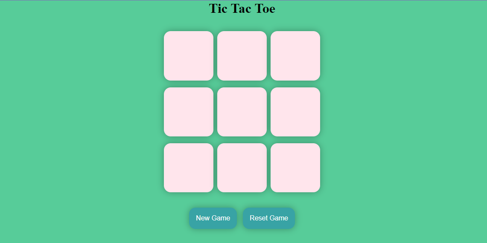

# Tic Tac Toe Game

## Overview

The **Tic Tac Toe Game** is a simple web application that allows two players to play the classic game of Tic Tac Toe. The game is built using HTML, CSS, and JavaScript.

## Features

- Two-player mode
- Responsive design
- Interactive UI with visual feedback
- Reset game functionality

## Demo

[Link to Demo](http://192.168.1.9:59295/index.html)

## Screenshots

### Game Interface



### Player Win


## Installation

To run this project locally, follow these steps:

1. Clone the repository:
   ```bash
   git clone https://github.com/your-username/tic-tac-toe.git
   ```
2. Navigate to the project directory:
   ```bash
   cd tic-tac-toe
   ```
3. Open `index.html` in your web browser.

## Usage

1. Open the application in your browser.
2. The first player (X) clicks on a cell to place their mark.
3. The second player (O) clicks on a different cell to place their mark.
4. Players alternate turns until one player wins or the game is a draw.
5. Click the "Reset" button to start a new game.

## Technologies Used

- HTML
- CSS
- JavaScript

## Contributing

Contributions are welcome! To contribute to this project, follow these steps:

1. Fork the repository.
2. Create a new branch:
   ```bash
   git checkout -b feature-branch
   ```
3. Make your changes.
4. Commit your changes:
   ```bash
   git commit -m 'Add some feature'
   ```
5. Push to the branch:
   ```bash
   git push origin feature-branch
   ```
6. Open a pull request.

## Contact

If you have any questions or suggestions, feel free to contact me at [harshthakur0047@gmail.com].
